# Design System Workflow Comparison

A detailed comparison of `/design-system-website` and `/design-system-figma-file` (also known as `/design-system`).

---

## High-Level Comparison

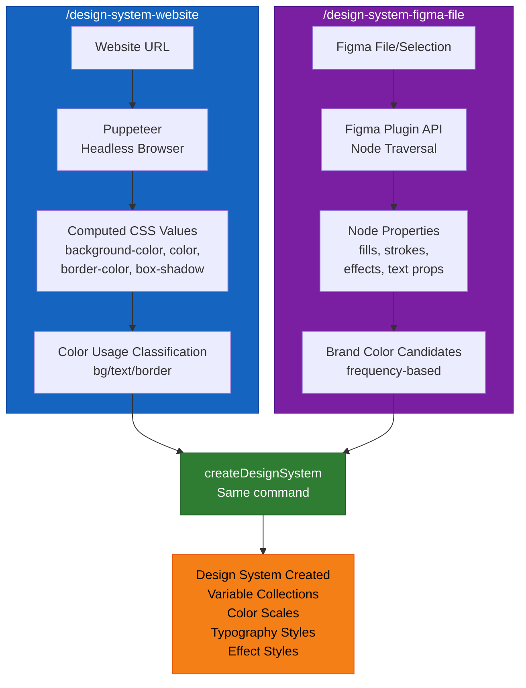

---

## Source Input Comparison

| Aspect | `/design-system-website` | `/design-system-figma-file` |
|--------|--------------------------|------------------------------|
| **Input Source** | Live website URL | Figma file or selection |
| **Extraction Method** | Puppeteer headless Chrome | Figma Plugin API |
| **Data Origin** | Computed CSS values | Node properties |
| **Network Required** | Yes (website access) | No (local Figma) |
| **Prerequisites** | Google Chrome installed | Figma plugin connected |

---

## Detailed Workflow: `/design-system-website`

```mermaid
flowchart TD
    subgraph step1[Step 1: Get Website URL]
        S1[User provides URL<br/>e.g., https://example.com/]
    end

    subgraph step2[Step 2: Ask Organizing Principle]
        S2A[4-Level Hierarchy - Default<br/>Primitive → Semantic → Tokens → Theme]
        S2B[3-Level Simplified<br/>Primitives → Tokens → Theme]
        S2C[2-Level Flat<br/>Primitives → Tokens]
        S2D[Material Design 3<br/>Reference → System → Component]
        S2E[Tailwind CSS Style<br/>Colors → Semantic]
    end

    subgraph step25[Step 2.5: Additional Options]
        S25A[Include boilerplate?]
        S25B[Create grid styles?]
        S25C[Gray base tone?]
        S25D[Clean up existing?]
    end

    subgraph step3["Step 3: Extract Website CSS ⭐ UNIQUE"]
        direction TB
        S3A[Puppeteer launches Chrome] --> S3B[Navigate to URL<br/>Wait for idle]
        S3B --> S3C[Scan ALL DOM elements<br/>Get computed styles]
        S3C --> S3D[/"Returns:
        colors with USAGE
        typography
        spacing
        borderRadius
        shadows
        screenshot"/]
    end

    subgraph step4[Step 4: Confirm Colors + Usage Mapping]
        S4A[Background Colors<br/>#344128 dark green - 36x]
        S4B[Text Colors<br/>#CFD0C0 light sage - 24x]
        S4C[Border/Accent Colors<br/>#FEC820 gold - 12x]
        S4D[User confirms mapping:<br/>background → Brand-500<br/>text → Tertiary-500<br/>border → Secondary-500]
    end

    subgraph step5[Step 5: Create Design System]
        S5[createDesignSystem<br/>with brandColors,<br/>organizingPrinciple,<br/>extractedTokens]
    end

    subgraph step6["Step 6: Bind by Extracted Usage ⭐ UNIQUE"]
        S6A[bindByExtractedUsage<br/>NOT autoBindByRole!]
        S6B[Maps by SEMANTIC USE:<br/>Background → Brand-500<br/>Text → Tertiary-500<br/>Border → Secondary-500]
    end

    subgraph step7[Step 7: Apply Styles]
        S7A[applyMatchingTextStyles]
        S7B[applyMatchingEffectStyles]
    end

    subgraph step8[Step 8: Report Results]
        S8[Summary:<br/>URL, elements scanned<br/>Colors by usage<br/>Screenshot<br/>Bindings applied]
    end

    step1 --> step2
    step2 --> step25
    step25 --> step3
    step3 --> step4
    step4 --> step5
    step5 --> step6
    step6 --> step7
    step7 --> step8

    style step3 fill:#e65100,stroke:#bf360c,color:#ffffff
    style step6 fill:#e65100,stroke:#bf360c,color:#ffffff
    style step1 fill:#1565c0,stroke:#0d47a1,color:#ffffff
    style step2 fill:#1565c0,stroke:#0d47a1,color:#ffffff
    style step25 fill:#1565c0,stroke:#0d47a1,color:#ffffff
    style step4 fill:#1565c0,stroke:#0d47a1,color:#ffffff
    style step5 fill:#1565c0,stroke:#0d47a1,color:#ffffff
    style step7 fill:#1565c0,stroke:#0d47a1,color:#ffffff
    style step8 fill:#1565c0,stroke:#0d47a1,color:#ffffff
```

### Website Extraction Output Structure

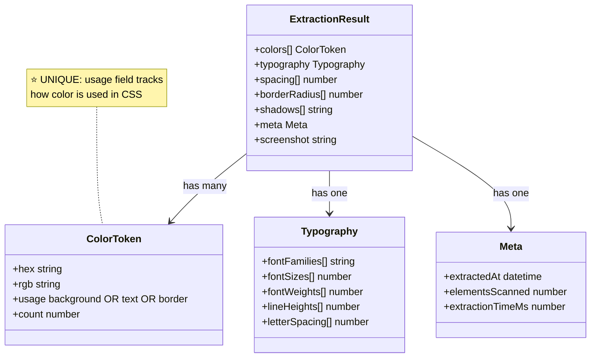

---

## Detailed Workflow: `/design-system-figma-file`

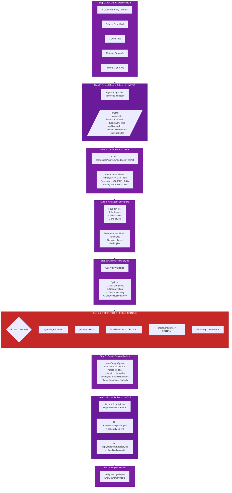

### Figma Extraction Output Structure

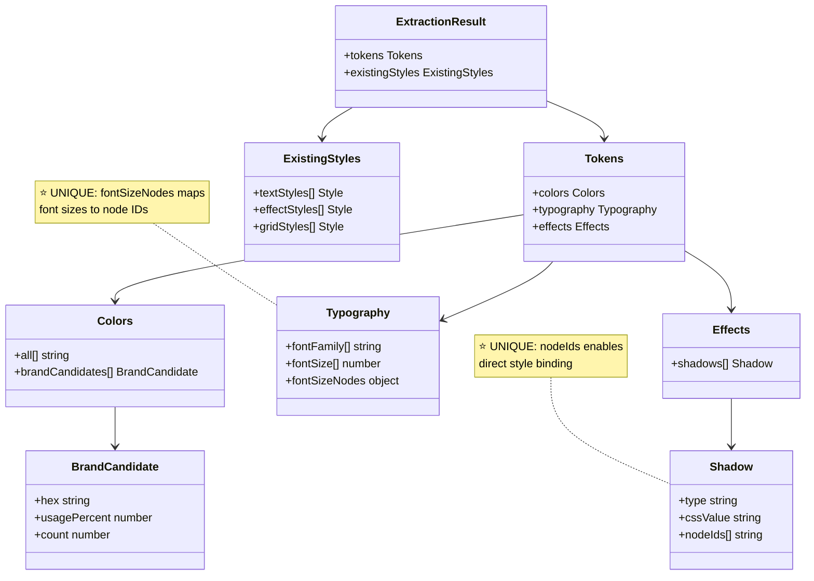

---

## Key Differences Summary

### 1. Data Source & Extraction

```mermaid
flowchart LR
    subgraph website[Website Workflow]
        W1[Live Website URL] --> W2[Puppeteer<br/>Headless Chrome]
        W2 --> W3[Computed CSS<br/>background-color<br/>color<br/>border-color<br/>box-shadow]
    end

    subgraph figma[Figma File Workflow]
        F1[Figma File<br/>Local/Cloud] --> F2[Plugin API<br/>Node Traversal]
        F2 --> F3[Native Properties<br/>fills[]<br/>strokes[]<br/>effects[]<br/>textStyleId]
    end

    style website fill:#1565c0,stroke:#0d47a1,color:#ffffff
    style figma fill:#7b1fa2,stroke:#4a148c,color:#ffffff
```

### 2. Color Classification Method

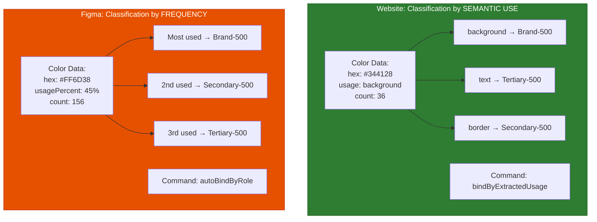

### 3. Node ID Tracking

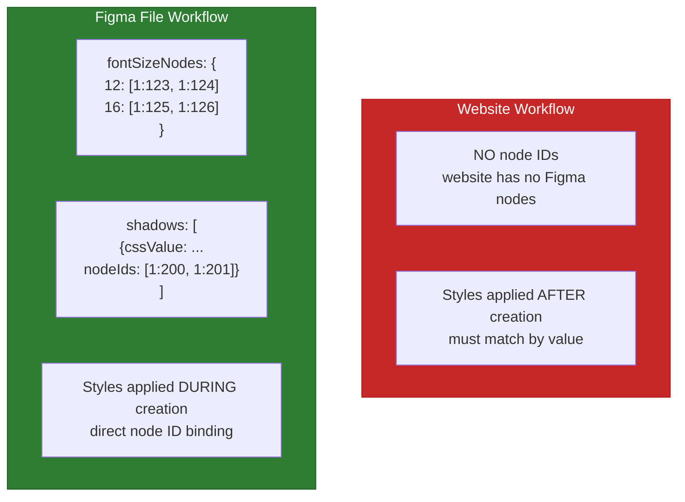

### 4. Step-by-Step Differences

| Step | `/design-system-website` | `/design-system-figma-file` |
|------|--------------------------|------------------------------|
| **1** | Get website URL | Ask organizing principle |
| **2** | Ask organizing principle | Extract design tokens |
| **2.5** | Ask additional options | N/A |
| **3** | Extract website CSS (Puppeteer) | Confirm brand colors |
| **4** | Confirm colors + usage mapping | Ask about boilerplate |
| **5** | Create design system | Ask about clearing existing |
| **5.5** | N/A | **PRE-FLIGHT CHECK** |
| **6** | Bind by extracted usage | Create design system |
| **7** | Apply text/effect styles | Bind variables to nodes |
| **8** | Report results | Report results |

### 5. Binding Strategy Comparison

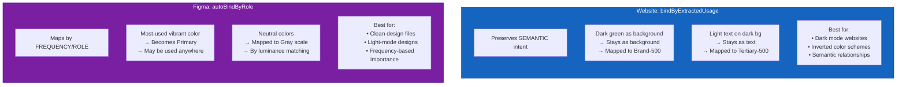

### 6. Pre-Flight Check (Figma File Only)

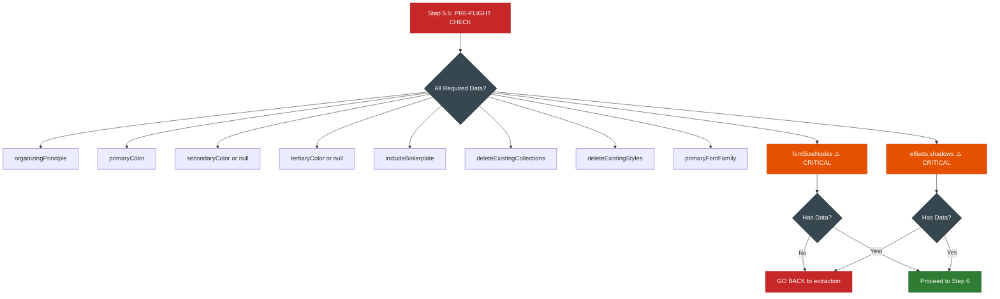

---

## When to Use Which Workflow

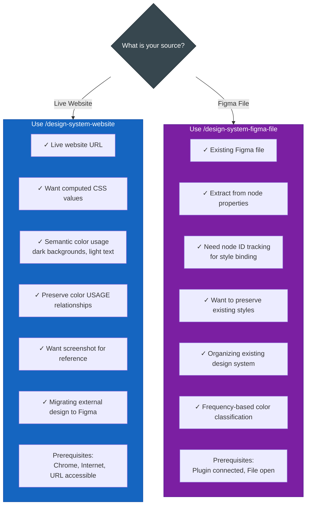

---

## Output Comparison

Both workflows produce the same final output structure:

### Variable Collections (4-Level Default)

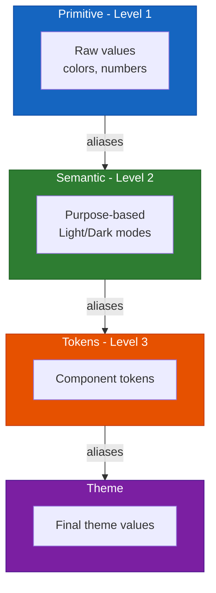

### Color Scales Created

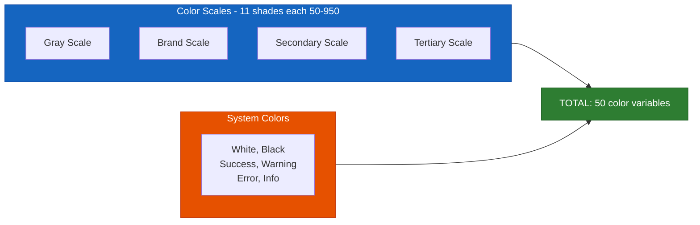

### Styles Created

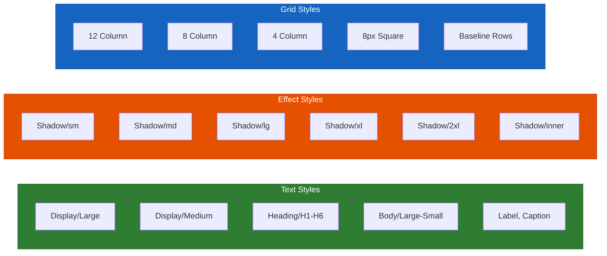

---

## Summary Table

| Feature | `/design-system-website` | `/design-system-figma-file` |
|---------|--------------------------|------------------------------|
| **Input** | Website URL | Figma file |
| **Extraction** | Puppeteer (headless Chrome) | Figma Plugin API |
| **Color Context** | Usage (background/text/border) | Frequency (most-used) |
| **Node Tracking** | No | Yes (fontSizeNodes, nodeIds) |
| **Binding Command** | `bindByExtractedUsage` | `autoBindByRole` |
| **Pre-Flight Check** | No | Yes (mandatory) |
| **Screenshot** | Yes (optional) | No |
| **Existing Styles** | Clean start | Can preserve or clear |
| **Network Required** | Yes | No |
| **Chrome Required** | Yes | No |
| **Best For** | External websites, dark mode | Existing Figma designs |

---

## Quick Reference: Commands Used

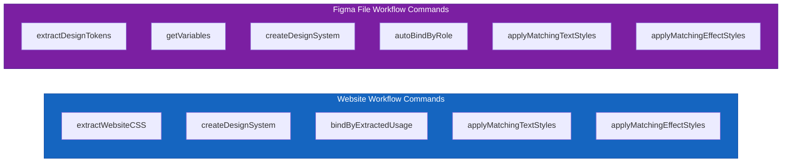
